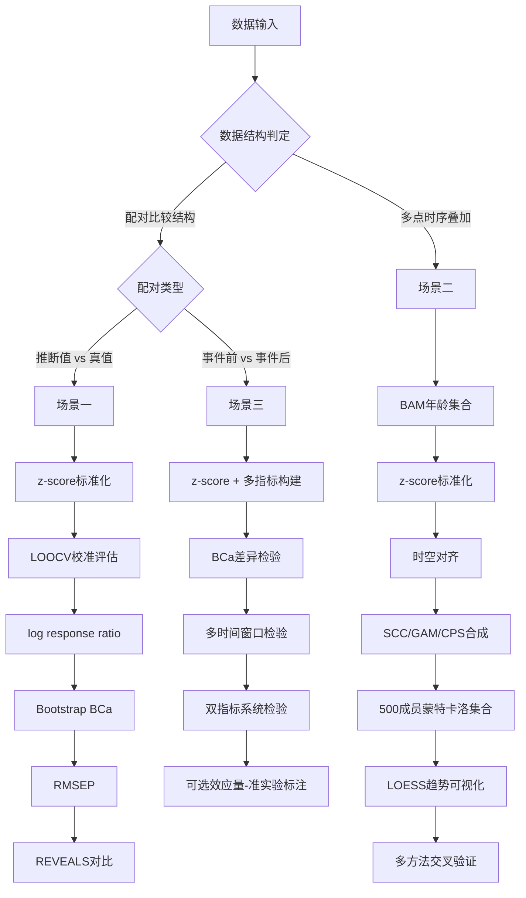

# 三类应用场景的方法配置

> 提取自源文档第六章及第 11.1 节决策流程图。本章将前述方法组装为三个面向实际研究场景的可执行方法链。方法选择决策见文末流程图。

## 1. 场景一 代用指标有效性评估

**数据结构特征**：存在配对比较——代用指标推断值（花粉重建的温度/降水）与已知真值（仪器观测、现代训练集、独立代理交叉验证）。唯一天然适配经典效应量的场景，满足 Hedges 1999 配对比较前提。

**推荐方法链**：
1. z-score 标准化各代理记录（Izdebski 2022, Kaufman 2020）
2. 留一交叉验证（LOOCV）评估校准模型（Birks et al. 2010）
3. log response ratio ln(X_proxy/X_observed) 量化系统偏差（Hedges 1999）
4. Bootstrap BCa 估计效应量置信区间（Izdebski 2022; scipy.stats.bootstrap）
5. RMSEP 报告预测精度（Kaufman 2020 Table 2）
6. REVEALS 模型转换花粉百分比为土地覆被比例，与实测植被对比（Roberts 2018, Sugita 2007）

**代码框架要点**：`log_response_ratio()` 返回 `np.log(x_proxy/x_observed)`；`effect_size_bca()` 包装 scipy.stats.bootstrap（method='BCa', n_resamples=10000）；`rmsep()` 计算 `np.sqrt(np.mean((predicted-observed)**2))`；`loocv()` 逐样本掩码重拟合校准函数。

**常见陷阱**：X_proxy 或 X_observed 含零值时 log response ratio 无定义，须加常数偏移或改用 Hedges' d；Bootstrap 要求 n > 20；校准模型的 LOOCV 须在校准集上进行，不可在独立验证集上混合使用。

**输出形式**：各代理类型的效应量森林图（含 BCa 置信区间）、RMSEP 表、校准散点图、LOOCV 残差分布。

## 2. 场景二 多站点植被变化综合

**数据结构特征**：多点沉积岩芯的时间序列，无处理/对照配对，存在年龄不确定性和自相关。经典效应量不适用——时序数据的相邻观测点违反独立性假设。

**推荐方法链**：
1. 年龄-深度建模：BAM 生成年龄集合（Comboul 2014; Kaufman 2020 验证与 Bacon 可比）；已有 Bacon 年表可直接消费
2. z-score 标准化各点位各分类群（Izdebski 2022, Power 2008）
3. 时空对齐：等面积网格化（Kaufman 2020）或按地理区域聚类（Izdebski 2022）
4. 合成：已校准数据用 SCC 或 GAM（PyGAM）；未校准数据用 CPS
5. 500 成员蒙特卡洛集合传播年龄+代理不确定性（Kaufman 2020）
6. LOESS 合成曲线可视化趋势（Marlon 2008; statsmodels.lowess）
7. 多方法交叉验证：同时运行 SCC+GAM+CPS，比较结果一致性

**代码框架要点**：`monte_carlo_ensemble(records, age_ensembles, proxy_errors, n_members=500)` 整体采样年龄成员保持地层单调性；`gam_composite(time, values, n_splines=20)` 用 LinearGAM 拟合；`uncertainty_band()` 提取 (5,50,95) 百分位；`loess_trend(time, values, frac=0.2)` 可视化。

**常见陷阱**：年龄扰动须保持地层顺序——从 BAM/Bacon 输出的完整年龄集合成员中整体采样，不可独立采样每个深度；不同记录的时间分辨率差异须先重采样到统一网格再合成，否则高频记录会主导合成结果。

**输出形式**：区域合成时间序列（含 90% 不确定性带）、多方法对比图（SCC/GAM/CPS 一致性检验）、LOESS 趋势曲线、逐一剔除检验结果。

## 3. 场景三 跨区域人地归因

**数据结构特征**：离散事件（森林砍伐期、农业强化期、政策变动期）前后的多点比较，跨区域对比归因。具有准实验结构（before-after），但不完全满足随机对照假设——事件的发生并非随机分配，且事件前后的时间窗口存在自相关。

**推荐方法链**：
1. z-score 标准化 + 多指标构建（Izdebski 2022 四指标模式：谷物、牧业、快速演替、慢速演替）
2. 事件前后子时段均值差异检验：Bootstrap 10000 次 + BCa 置信区间（Izdebski 2022）
3. Bayesian GAM 空间插值：薄板回归样条（Izdebski 2022 AverageR; Python: PyGAM 或 PyMC）
4. 多时间窗口稳健性检验：100 年/50 年/25 年三期分析
5. 双指标系统稳健性检验：两套独立生态指标分组对比（Ellenberg vs Niinemets）
6. 可选效应量补充：对显著变化计算 log response ratio 量化幅度，须标注为准实验设计

**代码框架要点**：`before_after_test(before, after, n_boot=10000)` 自定义 `mean_diff` 统计量做 BCa；`build_indicators(pollen_data, taxon_groups)` 按分组求和构建指标；`multi_window_robustness(data, event_year, windows=[100,50,25])`；`quasi_experiment_effect_size()` 返回 `np.log(np.mean(after)/np.mean(before))` 并标注"关联强度非因果效应"。

**常见陷阱**：事件边界年份的确定须基于独立证据（历史文献/政策记录），不可循环使用花粉数据自身确定事件年份——否则引入循环论证；准实验设计的效应量不可等同于因果效应，须明确标注为"关联强度"。

**输出形式**：区域归因分类图（Izdebski 2022 四情景模式）、空间差值图、多窗口稳健性表、效应量比较图（标注准实验限制）。

## 4. 方法选择决策流程图（11.1 节）

## 5. 与其他模块的衔接

- 场景一/三效应量激活判据 ← [effect_size.md](effect_size.md) 第 3 节
- 场景二合成方法 ← [synthesis_methods.md](synthesis_methods.md) 第 1、2、5 节
- 三场景数据预处理 ← [preprocessing.md](preprocessing.md)
- 准实验限制与缺口处理 ← [methodology_gaps.md](methodology_gaps.md) 第 3 节
- 验证策略 ← [validation.md](validation.md) 第 3 节
